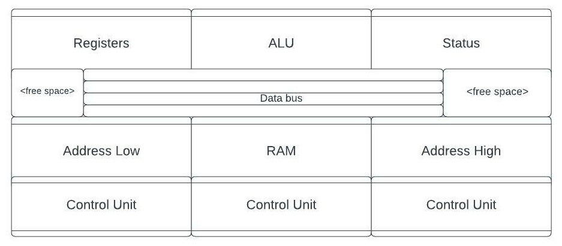
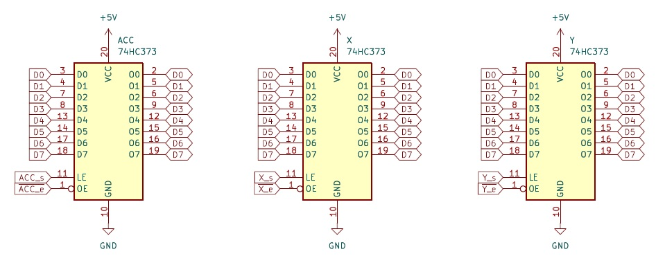
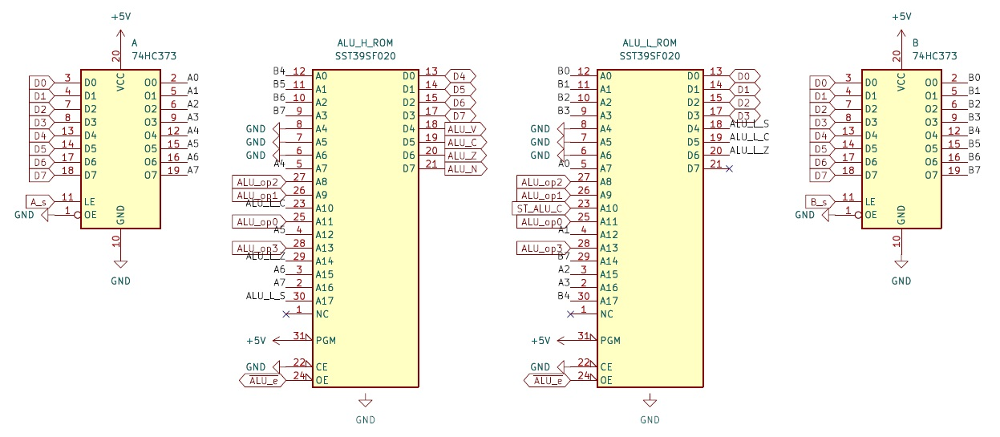
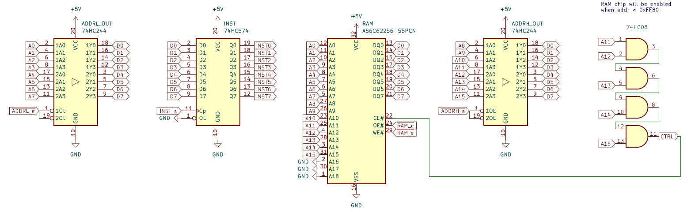

# flash6502

Trying to build a 6502-compatible CPU on breadboards, using as few chips as possible.

## Introduction
For a while I've been working on small projects that implement various "toy/fictitious" CPUs (namely the [Scott CPU](https://github.com/patrickleboutillier/jcscpu-hmc)) using discrete components, but I grew frustrated for 2 reasons:

1. Memory space is usually to small to create useful/fun programs.
2. You have to write your own assembler and tool chain.

After viewing Ben Eater's great video series on the 6502, I wondered if it might be possible to implement a 6502 CPU (not *a computer using a 6502 CPU chip*...) on breadboards using discrete components. Also, since breadboard projects tend to take up a lot of space very quickly (in squares inches I mean), I decided to try and use the least amount of chips possible, ideally under 40.

## Architecture

### Architecture Decisions
In order to achieve these goals, I made the following architecture decisions:

- It's ok if it's slower (perhaps even some orders of magnitude slower) than a real 6502.
- It's ok for the design to be assisted by a microcontroller (i.e. Arduino) for power, clocking and for some complicated parts like the reset sequence.
- It's ok if it doesn't run actual existing 6502 ROMs, but it has to run programs that I write myself using a standard 6502 assembler.
- It's ok if the actual 6502 timing is not respected.
- It's ok to use chips that did not exist at the time the 6502 was designed, namely large ROMs (which are used extensively), in order to keep the chips count low and simplify the design.

### High-Level Architecture
The system is made up of 8 sections, which I will refer to using the following names:

- **Registers**: contains the Arduino controller, as well as the X, Y and ACC registers.
- **ALU**: contains the 8-bit ALU with 16 operations, as well as the A and B registers that are connected to it.
- **Status**: contains the status (P) register, as well as the status logic implementd in a ROM chip. There is also a multiplexer to select the source for the status bits (ALU or data bus) and a buffer to control sending the status byte to the data bus.
- **Data Bus**: the 8 bit data bus.
- **Address Low**: contains the low bytes of the stack pointer (SP), the program counter (PC) and the effective address (EA) register, all connected to the "address low" bus, as well as a buffer to allow sourcing any of these from the data bus.
- **Address High**: contains the high bytes of the stack pointer (SP), the program counter (PC) and the effective address (EA) register, all connected to the "address low" bus, as well as a buffer to allow sourcing any of these (except the high byte of SP which is a constant) from the data bus.
- **RAM**: contains the instruction register (INST), the 64k RAM chip (connected to the "address low" and "address high" busses, as well as the data bus) and the memory mapping logic, as well as 2 buffers allowing to send the contents of the "address low/high" buses to the data bus.
- **Control Unit**: contains the stepping logic and 5 ROM chips that handle the 40 control signals. Each ROM chip receives the output of the step counting (6 bits), the output of the INST register (8 bits), as well as 4 other input signals that vary depending on the chip.

### Breadboard Block Diagram

## Sections
### Registers

The Registers section contains 3 registers, ACC, X and Y, implemented using SN74HC373 chips. These registers are connected to the Data Bus. There are 6 control signals used to set or enable each of these 3 registers: *ACC_e*, *ACC_s*, *X_e*, *X_s*, *Y_e*, *Y_s*.

### ALU

The ALU section contains 2 registers, A and B, implemented using SN74HC373 chips. These registers can be set from the Data Bus, and their outputs are fed directly into the ALU. The ALU is made up of 2 SST39SF020A Flash chips. It has 15 operations that can be selected using 4 controls bits.
The operations are defined as such:

    #define ALU_ADC  0    // For ADC instruction
    #define ALU_AND  1    // For AND instruction
    #define ALU_BIT  2    // For BIT instruction
    #define ALU_CMP  3    // For CMP instruction
    #define ALU_DEC  4    // For DEC instruction
    #define ALU_EOR  5    // For EOR instruction
    #define ALU_INC  6    // For ADC instruction
    #define ALU_LSR  7    // For LSR instruction
    #define ALU_ORA  8    // For ORA instruction
    #define ALU_ROL  9    // For ROL instruction
    #define ALU_ROR  10   // For ROR instruction
    #define ALU_SBC  11   // For SBC instruction
    #define ALU_PASS 12   // Passes through the contents of the B register
    #define ALU_ADD  13   // ADD w/o carry. Used mostly in address calculations
    #define ALU_SXT  14   // Sign extention, used in relative address calculation

Here are the details of each of the pins for the 2 Flash chips, ALU Low and ALU High:
#### ALU Low
- A16, A15, A12, A7: The low nibble of the A register.
- A3, A2, A1, A0: The low nibble of the B register.
- A13, A8, A9, A11: The ALU operation (see above).
- A10: The "ALU carry" output of the Status section.
- A17: Bit 4 of the B register. Used, for example, during the "shift right" operations.
- A14: Bit 7 of the B register. Used during the "sign extend" operation. 
- DQ3, DQ2, DQ1, DQ0: The low nibble of the result of the operation (these pins are connected to the Data Bus).
- DQ6: The "zero" output of the operation.
- DQ5: The "carry" output of the operation.
- DQ4: The "shift" output of the operation.
- OE#: Connected to the *ALU_e* control signal used to enable the result onto the Data Bus.

#### ALU High
- A16, A15, A12, A7: The high nibble of the A register.
- A3, A2, A1, A0: The high nibble of the B register.
- A13, A8, A9, A11: The ALU operation (see above).
- A10: The "carry" output from ALU Low.
- A17: The "shift" output fron ALU Low.
- A14: The "zero" output fron ALU Low.
- DQ3, DQ2, DQ1, DQ0: The high nobble of the result of the operation (these pins are connected to the Data Bus).
- DQ7: The N output flag of the ALU.
- DQ6: The Z output flag of the ALU.
- DQ5: The C output flag of the ALU.
- DQ4: The V output flag of the ALU.
- OE#: Connected to the *ALU_e* control signal used to enable the result onto the Data Bus.

#### Control signals
The control signals for the ALU section are *ALU[3-0]*, *ALU_e*, *A_s* and *B_s*.

### Status

The Status section is made up of the P register, which stores the current values for the Status flags, as well a custom flag (ALU_C) to store the carry used for the ALU carry-in signal, which may be different from the Status carry (C) flag.

The Status ROM is the brains of the Status module. It receives as input:
- The outputs of the P register (the "current" Status flag values)
- The "new" Status flag inputs, that come either from the ALU or from the Data Bus
  - 2 SN74HC157 MUX chips are used to feed these inputs to the Status ROM 
- Control signals that indicate which Status flags are to be set

Finally the Status module also contains a SN74HC244 chip that controls the sending of the Status flags to the Data Bus when required.

#### Control signals
The control signals for the Status section are *ST_e*, *ST_bi*, *ST_src*, *ST_NZ_s*, *ST_C_s*, *ST_V_s*, *ST_I_s*, *ST_ALU_C_s*, *ST_ALU_C_from_C*.

### Data Bus
The Data Bus is really just a combination of 4 breadboard power rails, along with some LEDs to help with debugging.
### Address Low

TODO: Description
### Address High

TODO: Description
### RAM

TODO: Description
### Control Unit

TODO: Description
### Arduino Controller

TODO: Description

## Schematic
You cn find the complete KiCAD SChematic here: [KiCAD Schematic](./docs/kicad/flash6502/)
